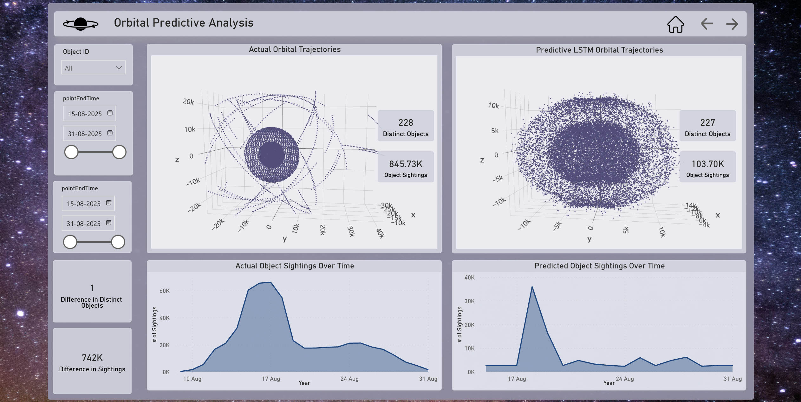

# OrbitShield 🚀  
**AI-Driven Space Debris Collision Risk Management**  
*Built at Women in Data Datathon 2025 by Team Datanova*  

  

---

## Overview  
Space isn’t as empty as it looks. Thousands of satellites and millions of debris fragments orbit Earth, and one wrong trajectory could trigger a chain reaction of collisions.  

**OrbitShield** is our attempt to make space situational awareness **predictive, explainable, and actionable**.  
We combined **geospatial analytics, machine learning, and real-time alerts** to identify collision risks and make orbital safety more transparent.  

---

## Key Features  
- **Data Fusion:** Pulled and consolidated **845K+ orbital records** via REST APIs (Ephemeris, State Vectors, Metadata).  
- **Geospatial Analysis:** DBSCAN clustering on orbital trajectories to detect debris-dense regions.  
- **ML Forecasting:** Random Forest, XGBoost, and LSTM models to predict collision risks and future positions.  
- **Human-Centric Alerts:** WhatsApp alerts with plain-English warnings instead of raw risk scores.  
- **Visualization:** Interactive dashboard showing orbital clusters, risks, and trajectory forecasts.  

---

## Metrics & Results  
- **Dataset size:** 845K records | 228 unique objects  
- **Clusters identified:** 7 orbital debris clusters  
- **Risk classification:**  
  - High Risk: 45 satellites  
  - Medium Risk: 55 satellites  
  - Low Risk: 4955 satellites  
- **Forecasting:** LSTM achieved accurate position predictions (x, y, z) across epochs.  
- **Alerts:** Generated explainable notifications with risk + confidence scores.  

  

---

## Tech Stack

* **Data Pipeline:** Python (Pandas, NumPy), REST APIs
* **Database & GIS:** PostgreSQL + PostGIS
* **Clustering:** DBSCAN (scikit-learn)
* **Modeling:** Scikit-learn (RF, XGBoost), TensorFlow/Keras (LSTM)
* **Visualization:** Plotly,PowerBi
* **Alerts:** WhatsApp API, HuggingFace Transformers
  
---

## Visuals & Dashboards

Key outputs and deliverables:

  

  

 

 

---

## 👩‍🚀 Team Datanova

* **Kamayani Rai** – Applied Analytics & Machine Learning
* **Kundana Rasi Tadikonda** – Analytics Engineering & Visualization
* **Julia Davis** – Industrial Engineering & Visualization
* **Kimberley Gillette** – Data Science & Machine Learning

---

## Future Scope

* Real-time integration with live orbital feeds.
* Reinforcement learning for automated maneuver recommendations.
* Public-facing dashboard for policy makers, educators, and global transparency.

---
